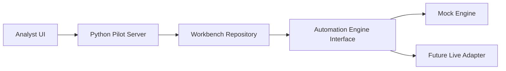
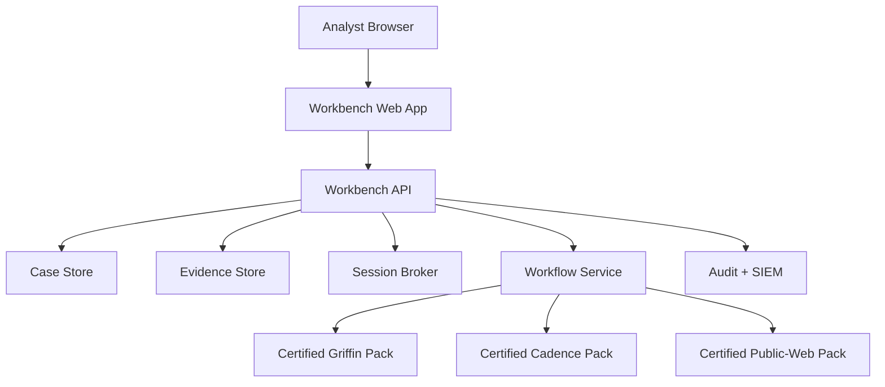

# Architecture

## Goal

Wrap a reusable workflow engine in an analyst-friendly compliance workbench that hides automation internals and exposes only certified search experiences.

## Current pilot architecture

## Operating model

### Analyst surface

- Case queue
- Certified Search Pack picker
- Source-by-source status board
- Evidence cards
- Decision and notes

### Admin surface

- Pack catalog
- Step definitions
- Governance controls
- Publication state

### Future enterprise services

- SSO and RBAC
- Session broker for Griffin and Cadence
- Central evidence storage
- Audit streaming to enterprise logging
- Health checks and pack re-certification

## Integration path

The integration seam is the `engine` object used by `WorkbenchRepository`.

### Today

- `MockAutomationEngine` produces deterministic demo data.

### Next

- `WorkflowServiceAdapter` should translate a Search Pack into one or more approved workflow actions.
- Each pack step should map to a certified source action.
- Source outputs should be normalized into the case evidence schema used by the UI.

## Production design target

## Non-negotiable controls

- Read-only execution in phase 1
- Source allowlist
- Evidence timestamps on every artifact
- Reviewer approval before pack publication
- Explicit session-handoff handling for internal portals
